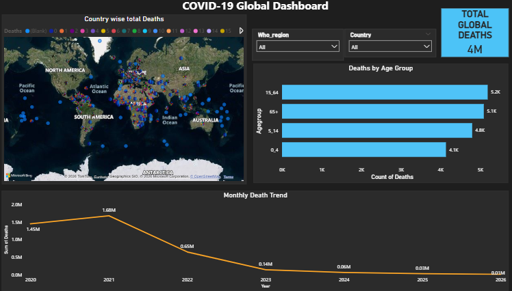

# Power BI Portfolio

Hi, I'm a Data Analyst. Welcome to my Power BI Portfolio.

## Project 1: HR Analytics Dashboard

**Tools Used**: Power BI, DAX, Excel

**About**: 
This dashboard analyzes employee attrition, workforce distribution, and salary trends to help HR make data-driven decisions.

**Key Insights**:
- Total Employees: 120K
- Attrition Rate: 26%
- Average Salary: 52.08K
- Highest Attrition in Operations Department

## Project 2: Ecommerce Sales Dashboard

**Tools Used**: Power BI, SQL, DAX

**About**:
This dashboard tracks sales performance, customer behavior, and product trends to boost ecommerce revenue.

**Key Insights**:
- Total Revenue: 2M
- Total Profit: 1M
- Average Order Value: 3.53K
- Total Orders: 500
- Top Selling Categories & Products
- Sales Trend by Month
- Order Status Breakdown
- Region & Channel Performance

---

## Project 3: COVID-19 Analytics Dashboard

**Tools Used**: Power BI, SQL

**About**:
This dashboard tracks COVID-19 cases, recoveries, deaths, and vaccination trends to support public health decisions.

**Key Insights**:
- Total Confirmed Cases
- Total Recoveries & Deaths  
- Vaccination Rate by Country
- Daily New Cases Trend

 

---

## Project 4: Netflix Data Analytics Dashboard

**Tools Used**: Power BI, Excel

**About**:
Analyzed Netflix dataset of 5337+ titles to uncover trends in Movies vs TV Shows, top genres, country-wise content, and release year patterns from 1942 to 2021.

**Key Insights**:
- **Total Content**: 5337 Titles, 3946 Directors
- **Genre Analysis**: Drama, Comedy, Documentaries are top genres
- **Movies vs TV Shows**: 97.23% Movies, 2.75% TV Shows
- **Global Reach**: Content from 190+ countries mapped
- **Trends**: Peak content added between 2015-2021
- **Ratings**: TV-MA and TV-14 are most common ratings

[Download PBIX File](Netflix.dashboard.pbix)
## More Projects Coming Soon...
