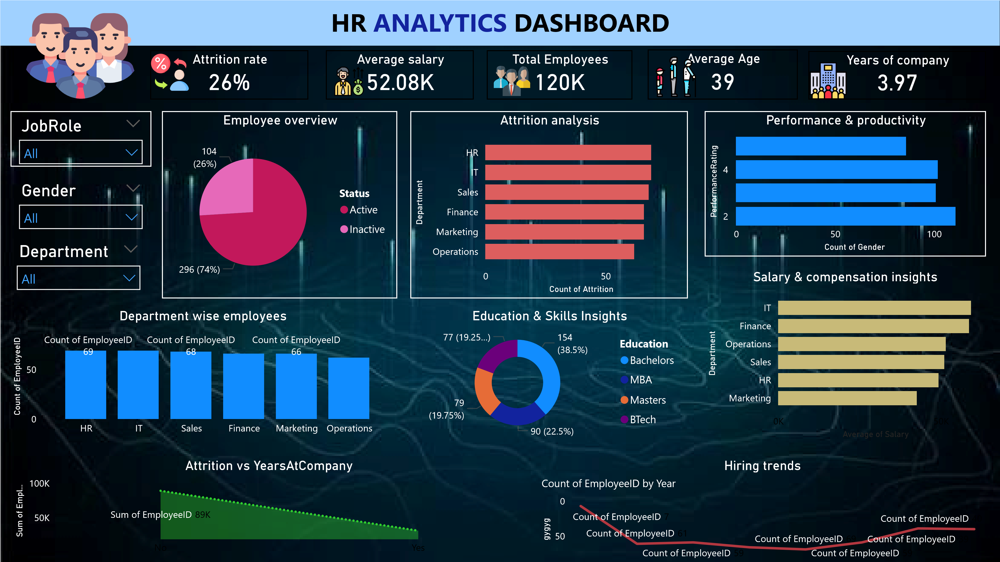

# Power BI Portfolio

Hi, I'm a Data Analyst. Welcome to my Power BI Portfolio.

## Project 1: HR Analytics Dashboard

**Tools Used**: Power BI, DAX, Excel

**About**: 
This dashboard analyzes employee attrition, workforce distribution, and salary trends to help HR make data-driven decisions.

**Key Insights**:
- Total Employees: 120K
- Attrition Rate: 26%
- Average Salary: 52.08K
- Highest Attrition in Operations Department

## More Projects Coming Soon...
